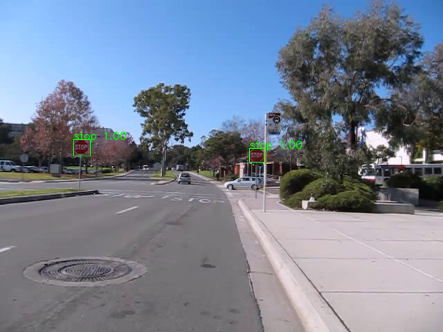
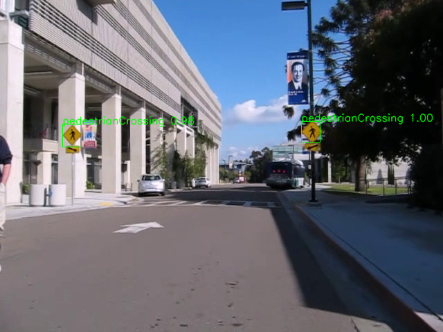
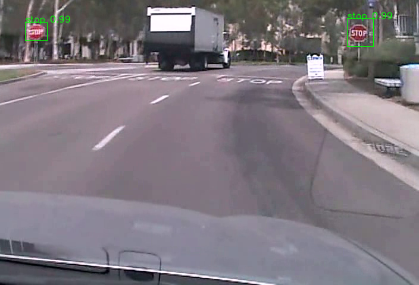
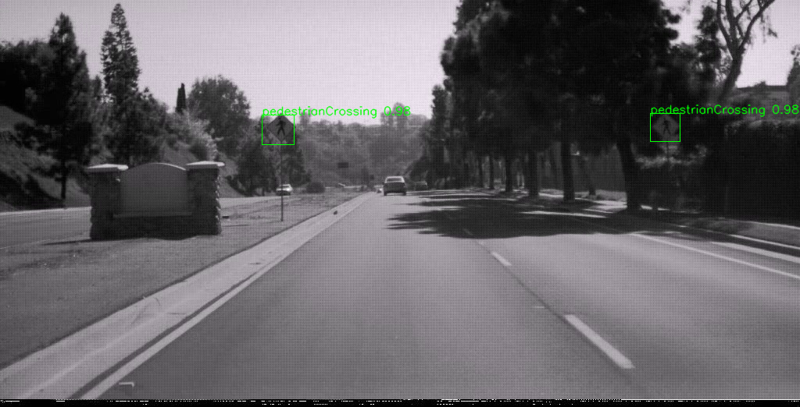
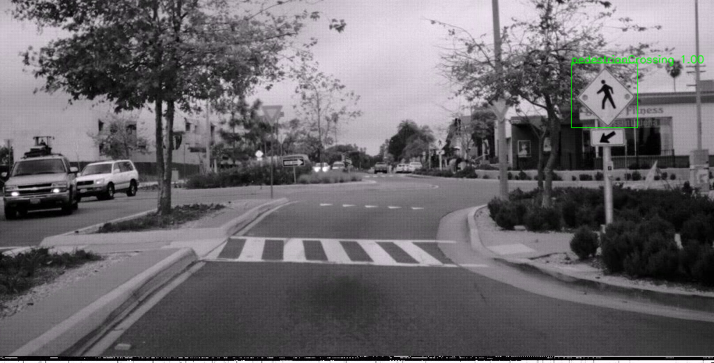

# SSD in TensorFlow: Traffic Sign Detection and Classification
## Overview
Implementation of [Single Shot MultiBox Detector (SSD)](https://arxiv.org/abs/1512.02325) in TensorFlow, to detect and classify traffic signs. This implementation was able to achieve 40-45 fps on a GTX 1080 with an Intel Core i7-6700K.

*Note this project is still work-in-progress*. The main issue now is model overfitting. I am currently working on pre-training on VOC2012 first, then performing transfer learning over to traffic sign detection.

Currently only stop signs and pedestrian crossing signs are detected. Example detection images are below.

The model was trained on the [LISA Traffic Sign Dataset](http://cvrr.ucsd.edu/LISA/lisa-traffic-sign-dataset.html), a dataset of US traffic signs.

## Dependencies
* Python 3.5+
* TensorFlow v0.12.0
* Pickle
* OpenCV-Python
* Matplotlib (optional)

## How to run
Clone this repository somewhere, let's refer to it as `$ROOT`

To run predictions using the pre-trained model:
* [Download the pre-trained model](https://drive.google.com/file/d/0BzaCOTL9zhUlekM3NWU1bmNqeVk/view?usp=sharing&resourcekey=0-0Lr57jKTTLJfqfHNTLsQuw) to `$ROOT`
* `cd $ROOT`
* `python inference.py -m demo`
  * This will take the images from sample_images, annotate them, and display them on screen
* To run predictions on your own images and/or videos, use the `-i` flag in inference.py (see the code for more details)
  * Note the model severly overfits at this time

Training the model from scratch:
* Download the [LISA Traffic Sign Dataset](http://cvrr.ucsd.edu/LISA/lisa-traffic-sign-dataset.html), and store it in a directory `$LISA_DATA`
* `cd $LISA_DATA`
* Follow instructions in the LISA Traffic Sign Dataset to create 'mergedAnnotations.csv' such that only stop signs and pedestrian crossing signs are shown
* `cp $ROOT/data_gathering/create_pickle.py $LISA_DATA`
* `python create_pickle.py`
* `cd $ROOT`
* `ln -s $LISA_DATA/resized_images_* .`
* `ln -s $LISA_DATA/data_raw_*.p .`
* `python data_prep.py`
  * This performs box matching between ground-truth boxes and default boxes, and packages the data into a format used later in the pipeline
* `python train.py`
  * This trains the SSD model
* `python inference.py -m demo`

## Differences between original SSD implementation
Obivously, we are only detecting certain traffic signs in this implementation, whereas the original SSD implemetation detected a greater number of object classes in the PASCAL VOC and MS COCO datasets. Other notable differences are:
* Uses AlexNet as the base network
* Input image resolution is 400x260
* Uses a dynamic scaling factor based on the dimensions of the feature map relative to original image dimensions

## Performance
As mentioned above, this SSD implementation was able to achieve 40-45 fps on a GTX 1080 with an Intel Core i7 6700K.

The inference time is the sum of the neural network inference time, and Non-Maximum Suppression (NMS) time. Overall, the neural network inference time is significantly less than the NMS time, with the neural network inference time generally between 7-8 ms, whereas the NMS time is between 15-16 ms. The NMS algorithm implemented here has not been optimized, and runs on CPU only, so further effort to improve performance can be done there.

## Dataset characteristics
The entire LISA Traffic Sign Dataset consists of 47 distinct traffic sign classes. Since we are only concered with a subset of those classes, we only use a subset of the LISA dataset. Also, we ignore all training samples where we do not find a matching default box, further reducing our dataset's size. Due to this process, we end up with very little data to work with.

In order to improve on this issue, we can perform image data augmentation, and/or pre-train the model on a larger dataset (e.g. VOC2012, ILSVRC)

## Training process
Given the small size of our pruned dataset, I chose a train/validation split of 95/5. The model was trained with Adadelta optimizers, with the default parameters provided by TensorFlow. The model was trained over 200 epochs, with a batch size of 32.

## Areas of improvement
There are multiple potential areas of improvement in this project:

* Pre-train the model on VOC2012 and/or ILSVRC
* Image data augmentation
* Hyper-parameter tuning
* Optimize NMS alogorithm, or leverage existing optimized NMS algorithm
* Implement and report mAP metric
* Try different base networks
* Expand to more traffic sign classes
